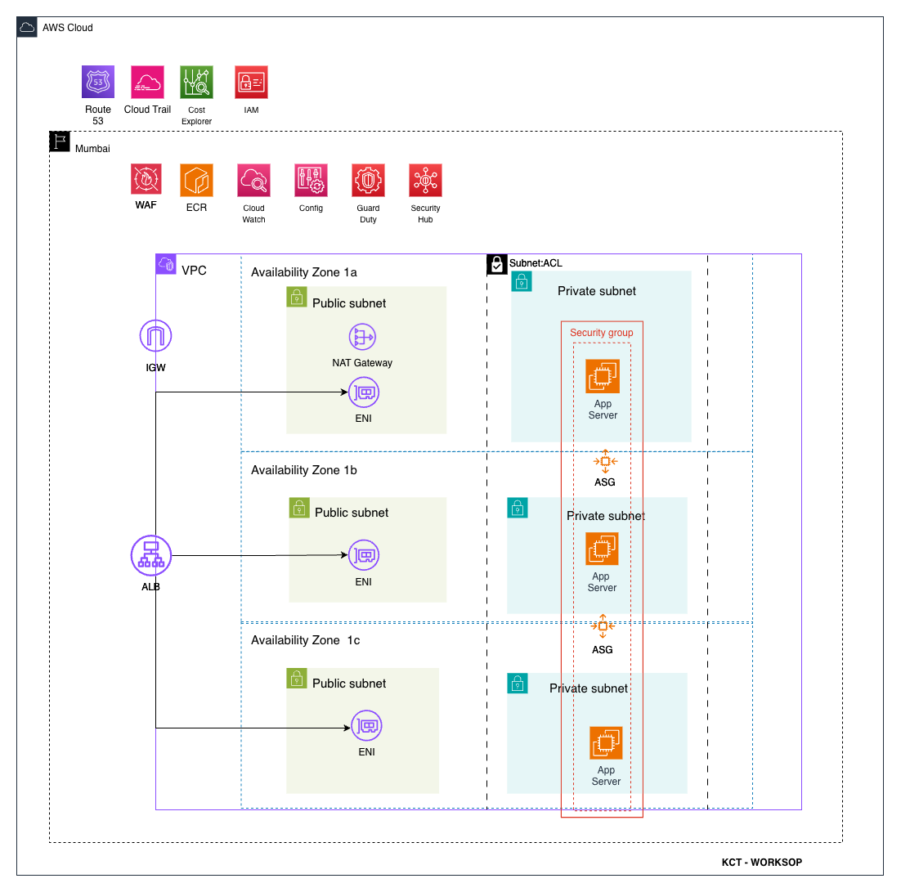

# Workshop Game

> **End-to-End Containerization and Cloud Deployment** — Workshop Demo Application

<p align="center">
  <strong>A high-speed, neon-styled typing game</strong><br/>
  Type falling words before they breach the firewall. Precision is key. Speed is survival.
</p>

<p align="center">
  
  
  
  
  
</p>

---

## Overview

### KCT Workshop — Key Topics

| # | Topic | Description |
|---|-------|-------------|
| 1 | **What is a Container?** | Lightweight, standalone executable packages that include everything needed to run an application—code, runtime, libraries, and config—ensuring consistency across environments. |
| 2 | **Why Containerize?** | Portability, consistency from dev to prod, faster deployments, efficient resource use, and easier scaling. |
| 3 | **Containerization Tools** | Docker, Podman, containerd, Kubernetes, AWS ECR, Amazon EKS. |
| 4 | **Why Choose a Cloud Platform?** | Scalability, global reach, pay-as-you-go, managed services, and reduced infrastructure overhead. |
| 5 | **Security Best Practices** | Image scanning, minimal base images, non-root user, secrets management, network isolation, and Security Groups. |
| 6 | **CI/CD** | Automated build, test, and deployment pipelines for faster, reliable releases. |

> **Demo App:** This repo uses a typing game to demonstrate end-to-end containerization and cloud deployment.

### Workshop Outcomes

By the end of this workshop, participants will be able to:

- **Run a web app locally** — Clone a repo, install dependencies, and start a development server (macOS, Linux, Windows)
- **Containerize with Docker** — Build a production-ready Docker image and run it locally
- **Deploy on AWS EC2** — Set up an EC2 instance (Amazon Linux), install Docker and Git
- **Use Amazon ECR** — Create a container registry, push images, and run containers from ECR
- **Complete the pipeline** — From local development to cloud deployment using industry-standard tools

---

## Architecture

<p align="center">
  
</p>

*Multi-AZ deployment in Mumbai region: VPC with public/private subnets, ALB, NAT Gateway, ECR, and App Servers behind Security Groups.*

---

## Prerequisites

- **Local:** Node.js 20+ ([nvm](https://github.com/nvm-sh/nvm) recommended)
- **EC2:** Amazon Linux 2 or Amazon Linux 2023, AWS CLI configured

> **Repository:** [github.com/duvarakesh1907/KCT-workshop](https://github.com/duvarakesh1907/KCT-workshop)

---

## 1. Run Locally (After Clone)

### macOS / Linux

```bash
# Clone the repository
git clone https://github.com/duvarakesh1907/KCT-workshop.git
cd KCT-workshop
```
*Downloads the project and moves into its directory.*

```bash
# Install dependencies
npm install
```
*Installs all required Node.js packages from package.json.*

```bash
# Start development server
npm run dev
```
*Starts the Vite dev server with hot reload on port 3000.*

### Windows (PowerShell)

```powershell
# Clone the repository
git clone https://github.com/duvarakesh1907/KCT-workshop.git
cd KCT-workshop
```
*Downloads the project and moves into its directory.*

```powershell
# Allow script execution (run once if you get execution policy errors)
Set-ExecutionPolicy -ExecutionPolicy RemoteSigned -Scope CurrentUser
```
*Enables running npm scripts in PowerShell (fixes "script execution disabled" errors).*

```powershell
# Install dependencies
npm.cmd install
```
*Installs all required Node.js packages (Windows executable).*

```powershell
# Start development server
npm run dev
```
*Starts the Vite dev server with hot reload on port 3000.*

Open **http://localhost:3000** in your browser.

---

## 2. Run with Docker (Local)

```bash
# Clone (if not already done)
git clone https://github.com/duvarakesh1907/KCT-workshop.git
cd KCT-workshop
```
*Downloads the project.*

```bash
# Build the image
docker build -t workshop-game .
```
*Builds a production-ready Docker image and tags it as `workshop-game`.*

```bash
# Run the container
docker run -d -p 8080:80 --name workshop-game workshop-game
```
*Runs the container in the background, mapping host port 8080 to container port 80.*

Open **http://localhost:8080** in your browser.

**Stop and remove:**
```bash
docker stop workshop-game      # Stops the running container
docker rm workshop-game        # Removes the stopped container
```

---

## 3. EC2 + Amazon ECR Deployment

Follow these steps on an **EC2 instance** running **Amazon Linux 2** or **Amazon Linux 2023**.

### Step 1: Update System & Install Git

**Amazon Linux 2023:**
```bash
sudo dnf update -y
```
*Updates all installed packages to the latest versions.*

```bash
sudo dnf install git -y
git --version
```
*Installs Git and verifies the installation.*

**Amazon Linux 2:**
```bash
sudo yum update -y
```
*Updates all installed packages.*

```bash
sudo yum install git -y
git --version
```
*Installs Git and verifies the installation.*

### Step 2: Install Docker

**Amazon Linux 2023:**
```bash
sudo dnf install docker -y
```
*Installs the Docker engine.*

```bash
sudo systemctl start docker
sudo systemctl enable docker
```
*Starts Docker now and enables it to start on boot.*

```bash
sudo usermod -aG docker $USER
newgrp docker
```
*Adds your user to the docker group so you can run Docker without sudo. `newgrp` applies the change in the current session.*

```bash
docker --version
```
*Verifies Docker is installed and running.*

**Amazon Linux 2:**
```bash
sudo yum install docker -y
sudo systemctl start docker
sudo systemctl enable docker
sudo usermod -aG docker ec2-user
newgrp docker
docker --version
```
*Same as above; use `ec2-user` as the default username on AL2.*

### Step 3: Clone the Repository

```bash
git clone https://github.com/duvarakesh1907/KCT-workshop.git
cd KCT-workshop
```
*Downloads the project source code to your EC2 instance.*

### Step 4: Create ECR Repository (One-time)

**Using AWS CLI:**
```bash
aws ecr create-repository --repository-name workshop-game --region ap-south-1
```
*Creates a new private container registry in ECR. Replace `ap-south-1` with your preferred region (e.g., `us-east-1`).*

**Note the repository URI from the output:**
```
"repositoryUri": "<account-id>.dkr.ecr.ap-south-1.amazonaws.com/workshop-game"
```
*Replace `<account-id>` with your 12-digit AWS account ID.*

### Step 5: Build the Docker Image

```bash
docker build -t workshop-game .
```
*Builds the app into a Docker image using the Dockerfile. The `-t` flag tags it as `workshop-game`.*

### Step 6: Authenticate Docker to ECR

```bash
aws ecr get-login-password --region ap-south-1 | docker login --username AWS --password-stdin <account-id>.dkr.ecr.ap-south-1.amazonaws.com
```
*Logs Docker into your ECR registry so you can push images. Replace `<account-id>` and `ap-south-1` with your values.*

**Get your AWS account ID:**
```bash
aws sts get-caller-identity --query Account --output text
```
*Outputs your 12-digit AWS account ID.*

### Step 7: Tag the Image for ECR

```bash
docker tag workshop-game:latest <account-id>.dkr.ecr.ap-south-1.amazonaws.com/workshop-game:latest
```
*Tags your local image with the full ECR URI so Docker knows where to push it. Replace `<account-id>` and region.*

### Step 8: Push to ECR

```bash
docker push <account-id>.dkr.ecr.ap-south-1.amazonaws.com/workshop-game:latest
```
*Uploads the image to your ECR repository. Replace `<account-id>` and region.*

### Step 9: Run the Container from ECR

```bash
docker run -d -p 8080:80 --name workshop-game <account-id>.dkr.ecr.ap-south-1.amazonaws.com/workshop-game:latest
```
*Pulls and runs the image from ECR. `-d` runs in background; `-p 8080:80` maps port 8080 to the container's port 80. Replace `<account-id>` and region.*

**Access the app:** `http://<EC2-PUBLIC-IP>:8080`

> Ensure EC2 Security Group allows inbound traffic on port 8080.

**Stop and remove:**
```bash
docker stop workshop-game    # Stops the container
docker rm workshop-game      # Removes the container
```

---

## Quick Reference: Full ECR Workflow

Set these variables once (replace `<account-id>` and region with your values):

```bash
export AWS_ACCOUNT_ID=<account-id>
export AWS_REGION=ap-south-1
export ECR_URI=${AWS_ACCOUNT_ID}.dkr.ecr.${AWS_REGION}.amazonaws.com/workshop-game
```
*Defines reusable variables for ECR URI. Use `aws sts get-caller-identity --query Account --output text` to get your account ID.*

Then run:

```bash
# 1. Update, install git & docker
sudo dnf update -y
sudo dnf install git docker -y
sudo systemctl start docker && sudo systemctl enable docker
sudo usermod -aG docker $USER
newgrp docker
```
*Updates system, installs Git and Docker, starts Docker, adds user to docker group.*

```bash
# 2. Clone
git clone https://github.com/duvarakesh1907/KCT-workshop.git
cd KCT-workshop
```
*Downloads the project.*

```bash
# 3. Build
docker build -t workshop-game .
```
*Builds the Docker image.*

```bash
# 4. Login to ECR
aws ecr get-login-password --region $AWS_REGION | docker login --username AWS --password-stdin $ECR_URI
```
*Authenticates Docker to ECR.*

```bash
# 5. Tag & Push
docker tag workshop-game:latest $ECR_URI:latest
docker push $ECR_URI:latest
```
*Tags and uploads the image to ECR.*

```bash
# 6. Run (stop/remove existing container first if needed)
docker rm -f workshop-game 2>/dev/null
docker run -d -p 8080:80 --name workshop-game $ECR_URI:latest
```
*Removes any existing container, then runs the app from ECR.*

---

## How to Play

1. Press **Enter** or click "Initialize System" to start
2. Type the first letter of any falling word to target it (highlighted in cyan)
3. Complete the entire word before it reaches the red zone at the bottom
4. You have 5 lives; each word that reaches the bottom costs 1 life
5. Score increases with word length and difficulty multiplier

---

## Tech Stack

| Category   | Technology        |
| ---------- | ----------------- |
| Framework  | React 19          |
| Language   | TypeScript 5.8    |
| Build Tool | Vite 6            |
| Styling    | Tailwind CSS 4    |
| Production | Nginx in Docker   |

---

## Project Structure

```
KCT-workshop/
├── src/
│   ├── components/NeonTypeGame.tsx
│   ├── data/words.ts
│   ├── utils/SoundManager.ts
│   ├── app.tsx
│   ├── main.tsx
│   └── index.css
├── Dockerfile
├── nginx.conf
└── package.json
```

---

## License

Licensed under the Apache License 2.0.
